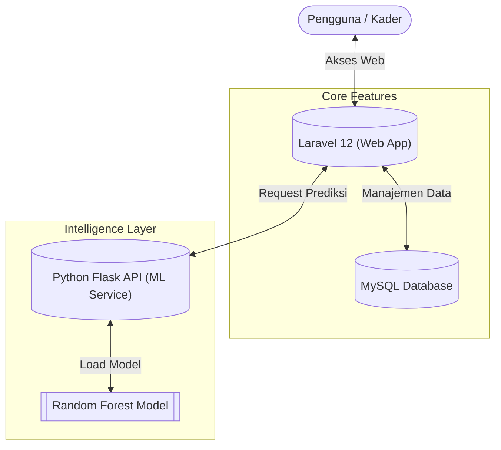

# PosyCare Balita - Sistem Pakar Manajemen Posyandu

PosyCare Balita adalah solusi digital terpadu untuk Posyandu yang menggabungkan manajemen data balita dengan teknologi kecerdasan buatan (AI) untuk pemantauan status gizi secara real-time.

## Arsitektur Sistem

Aplikasi ini menggunakan arsitektur *hybrid* yang menghubungkan keandalan Laravel untuk backend/frontend dengan ketepatan Python untuk analisis data.



- **Web App**: Laravel 12 (PHP) sebagai antarmuka utama.
- **ML Service**: Python Flask API untuk prediksi status gizi.
- **Database**: MySQL untuk penyimpanan data terpusat.

## Fitur Unggulan

- **Dashboard**: Ringkasan data posyandu dan aktivitas terkini.
- **Manajemen Balita**: Pencatatan lengkap data demografis balita.
- **Pencatatan Pengukuran**: Monitor BB, TB, Lingkar Kepala, dan LILA secara berkala.
- **Prediksi Gizi Cerdas**: Analisis otomatis status gizi (Normal/Buruk) menggunakan Machine Learning saat input data.
- **Laporan Komprehensif**: Ekspor data dan laporan posyandu siap cetak.

## Prasyarat Teknis

- PHP >= 8.2 & Composer
- Python >= 3.8 & PIP
- Node.js & NPM
- MySQL / MariaDB

## Panduan Instalasi Cepat

1.  **Clone & Setup Backend**
    ```bash
    composer install
    cp .env.example .env
    php artisan key:generate
    php artisan migrate
    ```

2.  **Setup Machine Learning**
    ```bash
    cd python_api
    pip install -r requirements.txt
    ```

3.  **Setup Frontend**
    ```bash
    npm install && npm run build
    ```

## Menjalankan Aplikasi

Jalankan kedua servis berikut di terminal terpisah:

**1. Machine Learning API** (Port 5000)
```bash
# Windows (Script)
start_flask.bat
# Atau Manual
python python_api/predict_api.py
```

**2. Web Server** (Port 8000)
```bash
php artisan serve
```

Akses aplikasi melalui: `http://localhost:8000`

## Lisensi

Software ini dilisensikan di bawah [MIT License](https://opensource.org/licenses/MIT).
